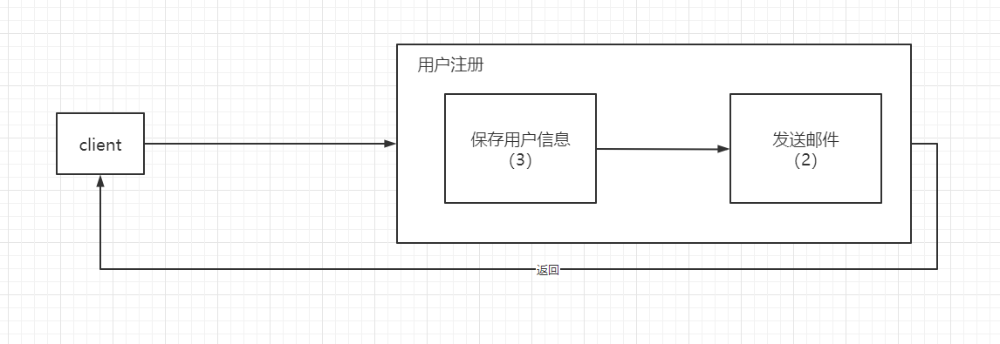

# 线程

​	现在大家一直高并发，那么什么是并发？并发的本质又是什么呢？

## 并发与并行

​	什么是并发？并发是指在某一**时间间隔**能处理完多少线程任务。比如：有100个线程同时发起了任务请求，由于电脑cpu核数的限制，不可能同时处理这个100个线程任务，但是CPU会有时间片切换，假如在1s内，将这100个线程任务处理完成，那么我们就可以说，并发量达到了100。

​	说到了并发，我们就不得不说说并行，那么什么是并行呢？并行是在同一**时刻**，可以同时运行的线程任务，受到CPU核数限制，比如4核的CPU，那么同一时刻，他只能运行4个线程任务。

​	好好体会一下，这两者的区别，一个是时间间隔内，一个是同一时刻。再举个例子，现在有100个小笼包，你能在1s内将这100个小笼包吃完，那么就说明你有100 的并发能力，但是在吃这个方式上，比如你能一口4个，那么说明你的并行数是4，一口8个，说明你的并行说是8。

## 什么是线程

​	上面我们说到并发与并行，一直在提一个词**线程**，从上面我们对并发和并行的描述，我们不难看出，线程，是计算机的最小运行单元，也就是真正去干活的人。官方给出的定义是，线程是操作系统能够运行和调度的最小单元。在一个进程中可以创建多个线程，这些线程可以并行执行多个任务，并行执行的线程数量是由CPU决定的。

## 线程的价值

​	计算机可以同时运行多个线程，那么线程对于我们开发来说，到底有什么价值呢？举个例子，以前我们有一个方法，用户注册，注册时需要两个步骤，一个是保存用户信息，二是发送邮件通知。如下图所示



那么我们处理完这个方法，就需要5s的时间，但是，我们要充分发挥资本家的嘴脸，一个线程在这干活，计算机还有能里处理其他线程能，那么正在创建一个线程，一起处理这个方法，但是你多个线程干活，你不能打乱本有的干活方式，所以，保存完用户信息，就可以返回去了，再创建一个线程，让他去发送邮件，我们不用管了。因为不管邮件是否发送成功，我们用户都注册成功了。经过改良就变成了下图的方式。


## 线程的创建

​	说完线程的价值，那么线程在我们java程序中是如何创建的呢？java创建线程，有三种方式

### 实现Runnable接口创建线程

Runnable 是声明一个线程的接口

```java
public class RunnableThreadDemo implements Runnable{

    @Override
    public void run() {
        System.out.println("RunnableThreadDemo#run");
    }

    public static void main(String[] args) {
        new Thread(new RunnableThreadDemo()).start();
    }
}
```

### 继承Thread类

```java
public class ThreadDemo extends Thread{

    @Override
    public void run() {
        System.out.println("ThreadDemo#run");
    }

    public static void main(String[] args) {
        new ThreadDemo().start();
    }
    
}
```

### 实现Callable接口并带返回值

```java
public class CallableThreadDemo implements Callable<String> {
    @Override
    public String call() throws Exception {
        return "CallableThreadDemo#call";
    }

    public static void main(String[] args) throws ExecutionException, InterruptedException {
        CallableThreadDemo callableThreadDemo = new CallableThreadDemo();
        FutureTask<String> futureTask = new FutureTask<>(callableThreadDemo);
        Thread thread = new Thread(futureTask);
        thread.start();
        System.out.println(futureTask.get());
    }
}
```

Runnable和继承Thread实现的方式不同，但是本质是一样的，都是接口Runnable的实现，但是当一个实现线程的类继承了其他类，就无法通过继承Thread类来实现线程了，只能通过实现Runnbale来实现。


Callable接口提供了一个返回值，定义了FutureTask，来表示获取未来结果的任务，并使用Thread线程来执行，最后可以通过futureTask.get()获取结果

## 线程的启动

​	我们已经知道了线程的实现方式，那么线程是如何启动的呢？从上面的案例我们已经能够知道，线程的启动并不是直接去调用他的run方法，而是调用start()，如果直接调用run()，就不涉及到线程一说了，和一个类直接调用执行方法没有任何区别。

## 线程的停止

线程该如何停止呢？

### Thread#stop()

stop()方法是大家熟知的线程停止方法，但官方不建议的使用，这个方法是线程不安全的，会导致两个问题

>立即抛出ThreadDeath异常，在run()中任何一个指令都有可能抛出该异常
>
>会释放当前线程持有的所有锁，这种锁的释放是不可控的

看一下代码

```jav
public class ThreadStop extends Thread{

    @Override
    public void run() {
        try {
            for (int i = 0;i<1000000;i++) {
                System.out.println("Running ....." + i);
            }
            System.out.println("the code that it will be executed");
        }catch (Throwable e) {
            e.printStackTrace();
        }

    }

    public static void main(String[] args) throws InterruptedException {
        ThreadInterrupt tt = new ThreadStop();
        tt.start();
        Thread.sleep(100);
        tt.stop();
    }
}
```

执行时，会出现以下执行结果

从结果可以看出以下两个问题

> 1、代码`System.out.println("the code that it will be executed")`并没有被执行，被ThreadDeath异常给中断了，造成业务处理不完整
>
> 2、在`Running .....9406`后并没有换行。为什么呢？我们看println代码
>
> ```java
> public void println(String x) {
>     synchronized (this) {
>         print(x);
>         newLine();
>     }
> }
> ```
>
> 可以看出先执行完print(x)，然后在执行newLine()，为了保证原子性，在这个方法上加了一个synchronized锁，但是stop()，会释放所有锁，从而导致newLine()还未执行，线程就被中断了。

因此在实际应用中，一定不能用stop()，来中断线程。那么该如何来中断线程呢？

### interrupt

Thread提供了一个interrupt()，用来向指定线程发送中断信号，指定线程根据Thread.isInterrupted()方法来判断是否被中断。

代码如下

```java
public class ThreadInterrupt extends Thread{
    @Override
    public void run() {
        int i = 0;
        while (!Thread.currentThread().isInterrupted()) {
            i++;
        }
        System.out.println("Thread is interrupted, i = " + i);
    }

    public static void main(String[] args) throws InterruptedException {
        ThreadInterrupt t = new ThreadInterrupt();
        t.start();
        TimeUnit.SECONDS.sleep(1);
        System.out.println("before: ThreadInterrupt 中断状态 ： " + t.isInterrupted());
        t.interrupt();
        System.out.println("after: ThreadInterrupt 中断状态 ： " + t.isInterrupted());
    }
}
```

执行结果

```tex
before: ThreadInterrupt 中断状态 ： false
after: ThreadInterrupt 中断状态 ： true
Thread is interrupted, i = 954319822
```

从上述结果可以看出，线程并没有直接武断的去终结线程，而是发出一个信号，我要去中断你了，然后把中断的标志改为true，线程在运行时，会去判断这个标志，当发现中断标志是true时，就结束该线程。

上面是安全环境中，那么如何结束阻塞的线程呢？例如sleep(),Object.wait()等方法阻塞，当其他线程想通过interrupt()方法对该线程进行中断，那么这个线程必须先被唤醒，否则无法中断信号。

我们看一个sleep()，方法阻塞的线程的中断过程。

```java
public class BlockedThreadInterrupt extends Thread{
    @Override
    public void run() {
        while (!Thread.currentThread().isInterrupted()){
            try {
                Thread.sleep(500);
            } catch (InterruptedException e) {
                e.printStackTrace();
            }
        }
        System.out.println("The thread is interrupted");

    }

    public static void main(String[] args) throws InterruptedException {
        BlockedThreadInterrupt t = new BlockedThreadInterrupt();
        t.start();
        TimeUnit.SECONDS.sleep(1);
        System.out.println("before: ThreadInterrupt 中断状态 ： " + t.isInterrupted());
        t.interrupt();
        System.out.println("after: ThreadInterrupt 中断状态 ： " + t.isInterrupted());
    }
}
```

运行结果


可以看到，虽然发出了中断标志，但是线程并没有结束。

从结果来看，我们可以得出两个结论

- 当调用interrupt()时，线程会被唤醒
- 中断前后的线程中断状态都是false，那么是否说明线程无法更改阻塞的线程中断状态标志呢？其实不然，在抛出InterruptedException异常之前，会对线程中断标志进行复位。这其实还是中断权的问题，其他线程要中断阻塞的线程，被中断的线程在收到其他线程中断的信号时，真正决定需不需要中断，是由自己决定。就打个比方，你本来要睡到早上8点起床（线程在阻塞，起床代表线程结束了），但是6点被你朋友唤醒去跑步（发出中断信号，被异常唤醒，此时线程还未结束，因为你还没起床，你还躺在床上），你收到别人让你起床的信号，但是决定是起床还是睡觉由你自己决定，你要起床（代表你要中断线程，那么你再调用一下interrupt（）方法；你要睡觉，那就不用调用interrupt（）方法就行，继续睡，虽然你醒过一次。

```java
public void run() {
    while (!Thread.currentThread().isInterrupted()){
        try {
            Thread.sleep(500);
        } catch (InterruptedException e) {
            // 处理你的逻辑

            // 如果要中断，调用该方法就可以
            Thread.currentThread().interrupt();
            e.printStackTrace();
        }
    }
    System.out.println("The thread is interrupted");
}
```

说到了线程的启动和停止，那么线程的生命周期有哪些呢？也就是说，线程有哪些状态呢？

## 线程的状态

线程的状态流转，我们可以看一张图。


对于java线程来说，状态有：NEW、RUNNABLE、BLOCKED、WAITING、TIME_WAITING、BLOCKED

### TIME_WAITING状态

```java
public static void main(String[] args) {
    new Thread(() -> {
        try {
            TimeUnit.SECONDS.sleep(1000);
        } catch (InterruptedException e) {
            e.printStackTrace();
        }
    },"TIME_WAITING_THREAD").start();
}
```

运行时可以通过jps查看进程id，然后通过jstack pid就可看到线程的状态

> jps
>
> jstack pid

```tex

"TIME_WAITING_THREAD" #14 prio=5 os_prio=0 cpu=0.00ms elapsed=22.62s tid=0x0000016593187000 nid=0x34d8 waiting on condition  [0x0000004c2f8fe000]
java.lang.Thread.State: TIMED_WAITING (sleeping) // 这里就是线程状态
at java.lang.Thread.sleep(java.base@11.0.12/Native Method)
at java.lang.Thread.sleep(java.base@11.0.12/Thread.java:339)
at java.util.concurrent.TimeUnit.sleep(java.base@11.0.12/TimeUnit.java:446)
at com.example.threadstudy.current.thread.TimeWaitingStatusDemo.lambda$main$0(TimeWaitingStatusDemo.java:10)
at com.example.threadstudy.current.thread.TimeWaitingStatusDemo$$Lambda$14/0x0000000800066840.run(Unknown Source)
at java.lang.Thread.run(java.base@11.0.12/Thread.java:834)
```

### WAITING状态

```java
public static void main(String[] args) {
    new Thread(() -> {
        synchronized (WaitingStatusDemo.class) {
            try {
                WaitingStatusDemo.class.wait();
            } catch (InterruptedException e) {
                e.printStackTrace();
            }
        }

    },"WAITING_THREAD").start();
}
```

```tex
"WAITING_THREAD" #14 prio=5 os_prio=0 cpu=0.00ms elapsed=25.46s tid=0x000001f053c19000 nid=0x3644 in Object.wait()  [0x00000040a23ff000]
   java.lang.Thread.State: WAITING (on object monitor) //线程状态
   at java.lang.Object.wait(java.base@11.0.12/Native Method)
   - waiting on <0x000000071135a260> (a java.lang.Class for com.example.threadstudy.current.thread.WaitingStatusDemo)
   at java.lang.Object.wait(java.base@11.0.12/Object.java:328)
   at com.example.threadstudy.current.thread.WaitingStatusDemo.lambda$main$0(WaitingStatusDemo.java:11)
   - waiting to re-lock in wait() <0x000000071135a260> (a java.lang.Class for com.example.threadstudy.current.thread.WaitingStatusDemo)
   at com.example.threadstudy.current.thread.WaitingStatusDemo$$Lambda$14/0x0000000800066840.run(Unknown Source)
   at java.lang.Thread.run(java.base@11.0.12/Thread.java:834)

```

### BLOCKED

```java
public class BlockedStatusDemo extends Thread{
    @Override
    public void run() {
        synchronized (BlockedStatusDemo.class) {
            while (true) {}
        }
    }
    public static void main(String[] args) {
        BlockedStatusDemo t1 = new BlockedStatusDemo();
        BlockedStatusDemo t2 = new BlockedStatusDemo();

        new Thread(t1,"BLOCKED_01").start();
        new Thread(t2,"BLOCKED_02").start();
    }
}
```

可以看出BLOCKED_01是RUNNABLE状态，BLOCKED_02是BLOCKED状态

```tex
"BLOCKED_01" #16 prio=5 os_prio=0 cpu=20359.38ms elapsed=20.49s tid=0x000001f6e0b5b800 nid=0x3674 runnable  [0x0000007c938fe000]
java.lang.Thread.State: RUNNABLE
at com.example.threadstudy.current.thread.BlockedStatusDemo.run(BlockedStatusDemo.java:8)
- locked <0x0000000711359c00> (a java.lang.Class for com.example.threadstudy.current.thread.BlockedStatusDemo)
at java.lang.Thread.run(java.base@11.0.12/Thread.java:834)
        
        
"BLOCKED_02" #17 prio=5 os_prio=0 cpu=0.00ms elapsed=20.49s tid=0x000001f6e0b5c000 nid=0x2080 waiting for monitor entry  [0x0000007c939fe000]
java.lang.Thread.State: BLOCKED (on object monitor)
at com.example.threadstudy.current.thread.BlockedStatusDemo.run(BlockedStatusDemo.java:8)
- waiting to lock <0x0000000711359c00> (a java.lang.Class for com.example.threadstudy.current.thread.BlockedStatusDemo)
at java.lang.Thread.run(java.base@11.0.12/Thread.java:834)
```

