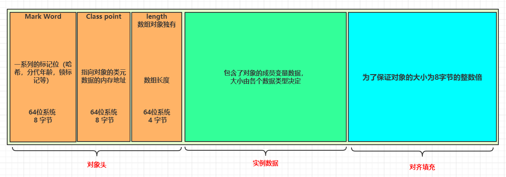

# synchronized

线程能很大提升程序的工作效率，但是使用不合理就会带来很多不可控的问题，比如线程安全问题。

什么是线程安全问题呢？当多个线程访问某个方法时，这个方法无法按照我们预期来执行，我们就认为这是线程不安全的。

那么导致线程不安全原因是什么呢？

- 原子性
- 有序性
- 可见性

## 原子性

什么是原子性？原子性指的是不可分隔，程序在执行时，不可中断。

我们看下面的代码

```java
public class AtomicDemo {
    volatile int i = 0;

    public void incr(){
        i++;
    }

    public static void main(String[] args) throws InterruptedException {
        AtomicDemo atomicDemo = new AtomicDemo();
        Thread t1 = new Thread(() -> {
            for (int i = 0; i<1000; i++) {
                atomicDemo.incr();
            }
        });
        Thread t2 = new Thread(() -> {
            for (int i = 0; i<1000; i++) {
                atomicDemo.incr();
            }
        });
        t1.start();
        t2.start();
        t1.join();
        t2.join();
        System.out.println("result：i=" + atomicDemo.i);
    }
}
```

运行结果：

```tex
result：i=1835
```

可以看到，预期出现的i值应是2000，但是并没有出现，导致这个问题的原因是什么呢？就是原子性，i++的操作并不是原子的，我们来看看i++，到底经历了哪些操作。

通过`javap -v AtomicDemo.class`，查看字节码

```tex
public void incr();
    descriptor: ()V
    flags: (0x0001) ACC_PUBLIC
    Code:
      stack=3, locals=1, args_size=1
         0: aload_0
         1: dup
         2: getfield      #2                  // Field i:I
         5: iconst_1
         6: iadd
         7: putfield      #2                  // Field i:I
        10: return
      LineNumberTable:
        line 7: 0
        line 8: 10
      LocalVariableTable:
        Start  Length  Slot  Name   Signature
            0      11     0  this   Lcom/example/threadstudy/current/syn/AtomicDemo;
```

可以看到i++，经历了4步操作：

> 第一步获取属性值：getfield
>
> 第二步将常量压入栈中：iconst_1
>
> 第三步在寄存器进行+1操作：iadd
>
> 第四步将结果保存在内存中：putfield

执行一个i++需要四步，也就是i++的操作不是原子性的。

既然我们已经知道了i++不是原子性的，那么什么样的情况会带来原子性问题呢？

- CPU时间片切换
- 多线程并行执行

线程的时间片切换导致原子性问题


多线程并行执行导致原子性问题


那么在程序中怎么解决这种因为多线程造成的原子性的问题呢？java代码提供了synchronized关键字，他是如何使用的呢？


## synchronized的使用

- 作用在方法级别，表示对当前方法加锁 ，这时不管多少线程要调用这个方法，但只能被一个线程调用成功，其他线程得等待。

```java
public synchronized void method1() {
        // TODO
}
```

- 作用在代码块级别，能访问到此代码块的线程，才会去竞争锁资源，此时根据锁的粒度来控制线程的访问

```java
synchronized(this){
    
}
```


## 锁的范围

synchronized是如何控制线程的访问的呢？这里就得说到锁的范围，你锁了多大的范围，决定了会有哪些线程来竞争你的锁资源。对于锁的范围分为：

> 类锁
>
> 对象锁

### 类锁

什么是类锁，简单的来说，就是拿这个类来当锁的锁，注意是说的是**类，类，类**，重要的事情说三遍。先看代码

- 直接以类做锁

```java
public void method1() {
    synchronized (SynchronizedArea.class) {
        
    }
}
```

- 以静态变量做锁

```java
public void method2() {
    synchronized (syn) {

    }
}
```

- 直接锁在静态方法上，注意是静态方法

```java
// 这个synchronized相当于synchronized(SynchronizedArea.class)
public static synchronized void method3() {
    
}
```

类锁的作用范围比较大，只要访问这个类加类锁的方法，或者代码块，都会拿到同一把类锁，这样，就很影响性能，对于业务来说，有可能就没有这个必要，这时我们就可以考虑另一种锁的范围，就是将范围缩小，对象锁。

### 对象锁

什么是对象锁呢？简单的来说，就是拿一个对象当锁，更符合的说法，就是拿一个实例当锁，也就是实例锁。先看代码

- 修饰普通方法

```java
public synchronized void method4() {}
```

- 以实例对象做锁

```java
public void method5() {
    Object lock = new Object();
    synchronized (lock) {
        // TODO
    }
}
```

### 总结

在总结之前，我们可以看一下类锁和对象锁的调用demo

- 类锁demo

```java
public class ClassSynDemo {

    public  void m1() {
        synchronized (ClassSynDemo.class) {
            while (true) {
                System.out.println("线程名：" + Thread.currentThread().getName());
                try {
                    Thread.sleep(1000);
                } catch (InterruptedException e) {
                    e.printStackTrace();
                }
            }
        }

    }

    public static void main(String[] args) {
        ClassSynDemo c1 = new ClassSynDemo();
        ClassSynDemo c2 = new ClassSynDemo();
        new Thread(()->c1.m1(), "t1").start();
        new Thread(()->c2.m1(), "t2").start();
    }
}
```

看一下运行结果

```tex
线程名：t1
线程名：t1
线程名：t1
线程名：t1
线程名：t1
```

- 对象锁demo

```java
public class ObjectSynDemo {

    Object lock = new Object();

    public  void m1() {
        synchronized (lock) {
            while (true) {
                System.out.println("线程名：" + Thread.currentThread().getName());
                try {
                    Thread.sleep(1000);
                } catch (InterruptedException e) {
                    e.printStackTrace();
                }
            }
        }

    }

    public static void main(String[] args) {
        ObjectSynDemo c1 = new ObjectSynDemo();
        ObjectSynDemo c2 = new ObjectSynDemo();
        new Thread(()->c1.m1(), "t1").start();
        new Thread(()->c2.m1(), "t2").start();
    }
}
```

看一下运行结果

```tex
线程名：t1
线程名：t1
线程名：t2
线程名：t1
线程名：t2
线程名：t2
```

总结一下就是，类锁，不能你多少个对象实例来访问，只能有一个线程能获得锁资源，而对象锁就不是这样，只要是不同的对象，都能获取这个锁资源。这么说可能还有些迷糊。

当线程区访问共享资源的时候，每个线程根据锁的对象，来访问资源，也就是说，如果这个线程和其他线程拿到的是同一个对象，就会有资源竞争问题，如果拿到的是不同的对象就不会产生资源竞争，直接进入。

那么对象为什么能作为线程竞争的锁呢？

## 锁的存储

如果我们区设计这个锁该怎么设计呢？当一个线程进来，看到当前锁的标识，如果是true就可以进入，如果不是，就不能进入。我们能把这标识存放在类中吗？显然不能，还是多线程竞争的问题，多个线程都来访问，你还未来的及改呢？都进入了，就失去了锁的意义。那么这个标志可以存放在哪里呢？锁的对象标志，存在对象中。

### java对象的存储

一个java对象的存储结构可以分为三个部分：对象头，实例数据，对齐填充。而对象头中就存放了锁标记。



### 对象头

这次我们只分析对象头，而对象头中，唯一可讲的就是这个Mark Word。Mark Word记录了对象和锁的信息，也就是当这个对象作为锁对象时，锁标记的相关信息就会存储在Mark Word中。

32位中Mark Word 的大小是4字节，而在64位中大小为8字节

32位：


64位：


### 验证

OpenJDK官方提供了一个JOL（java Object Layout）工具，帮我们查看java对象内存布局。

第一步引入依赖

```xml
<dependency>
    <groupId>org.openjdk.jol</groupId>
    <artifactId>jol-core</artifactId>
    <version>0.9</version>
</dependency>
```

第二步创建一个普通对象

```java
public class ClassLayoutDemo {}
```

第三步JOL打印这个对象内存布局

```java
public class ClassLayoutDemo {

    public static void main(String[] args) {
        ClassLayoutDemo classLayoutDemo = new ClassLayoutDemo();
        System.out.println(ClassLayout.parseInstance(classLayoutDemo).toPrintable());
    }
}
```

第四步打印结果

```tex
com.example.threadstudy.current.syn.ClassLayoutDemo object internals:
 OFFSET  SIZE   TYPE DESCRIPTION                               VALUE
      0     4        (object header)                           05 00 00 00 (00000101 00000000 00000000 00000000) (5)
      4     4        (object header)                           00 00 00 00 (00000000 00000000 00000000 00000000) (0)
      8     4        (object header)                           40 70 06 00 (01000000 01110000 00000110 00000000) (421952)
     12     4        (loss due to the next object alignment)
Instance size: 16 bytes
Space losses: 0 bytes internal + 4 bytes external = 4 bytes total
```

名称解释：

> OFFSET：偏移地址
>
> SIZE：字节大小
>
> TYPE DESCRIPTION：类型描述；（Object header）对象头
>
> VALUE：对应的内存中当前存储的值；

对象头中占了12个字节，其中前8个字节是Mark Word，后面是4个是Klass Pointer。

下图中标记的三位（101）就是锁的标记，01是锁的标记，1是偏向锁的标记


这里有几个疑问：

- 此时并没有锁的竞争，为什么会有偏向锁标记
- Klass Pointer在64位系统中为什么是4个字节
- 对象头占了12个字节，那么多余出来的4个字节又是什么呢？

偏向锁的问题，我们后面再讲，先回答后面两个问题

> Klass Point 为什么是4个字节，而不是8个字节，这里用到了指针压缩技术，为了更好的节省空间。JVM提供了一个-XX：-UseCompressedOps参数，可以将它关闭。
>
> 多余出来的4个字节是对齐填充，为了更快的访问资源。
