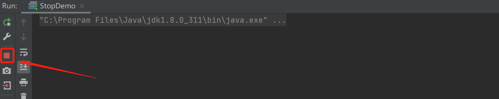
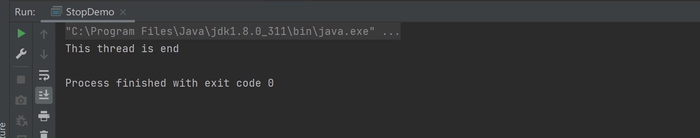
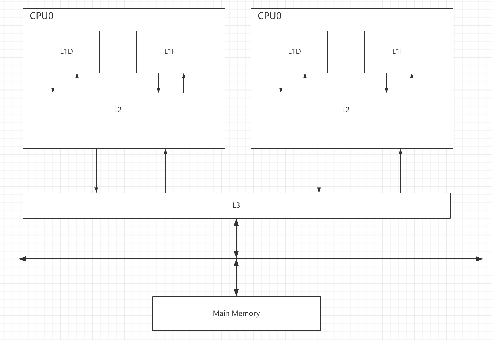
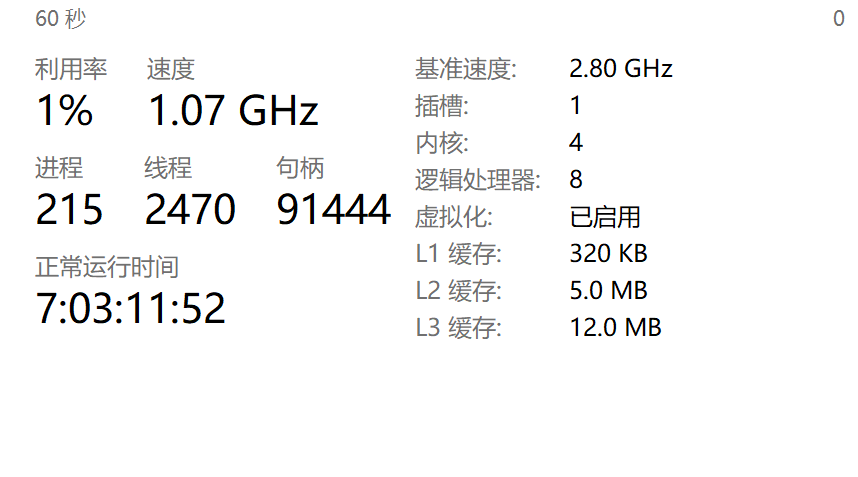
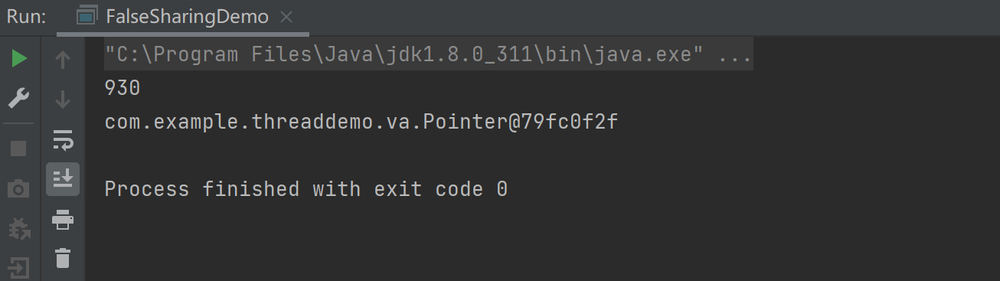
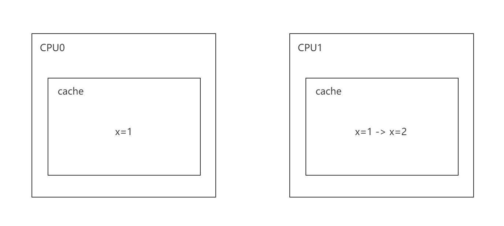
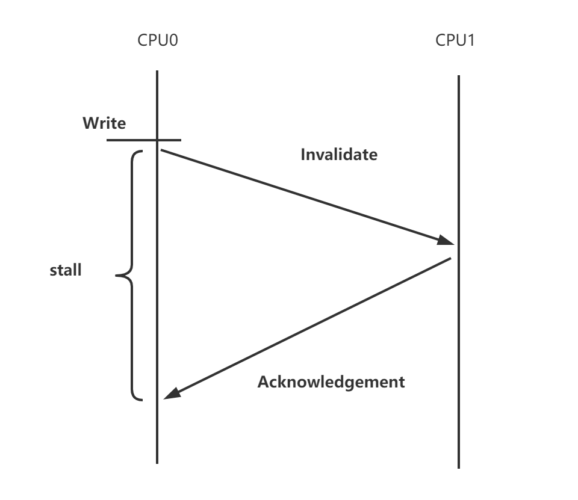
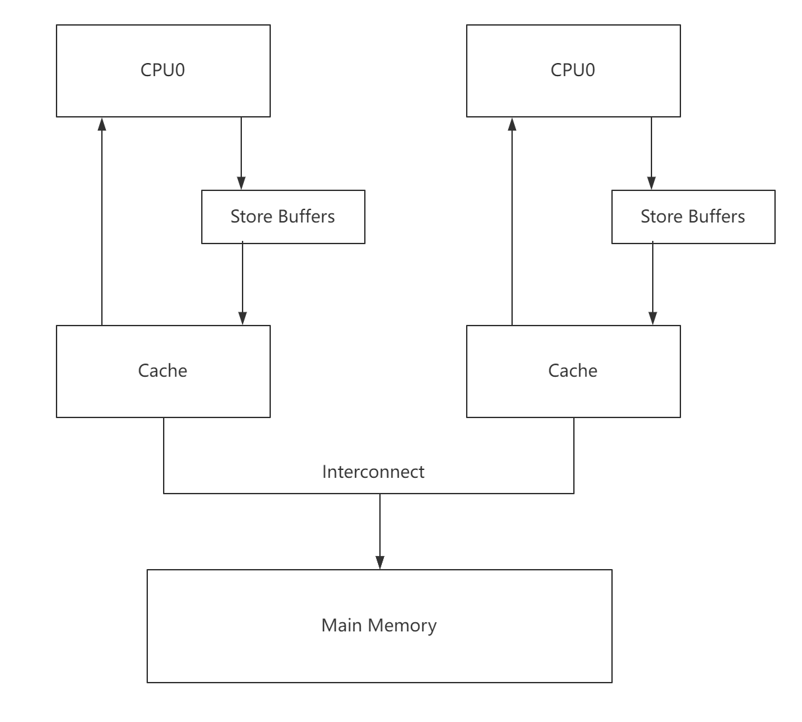
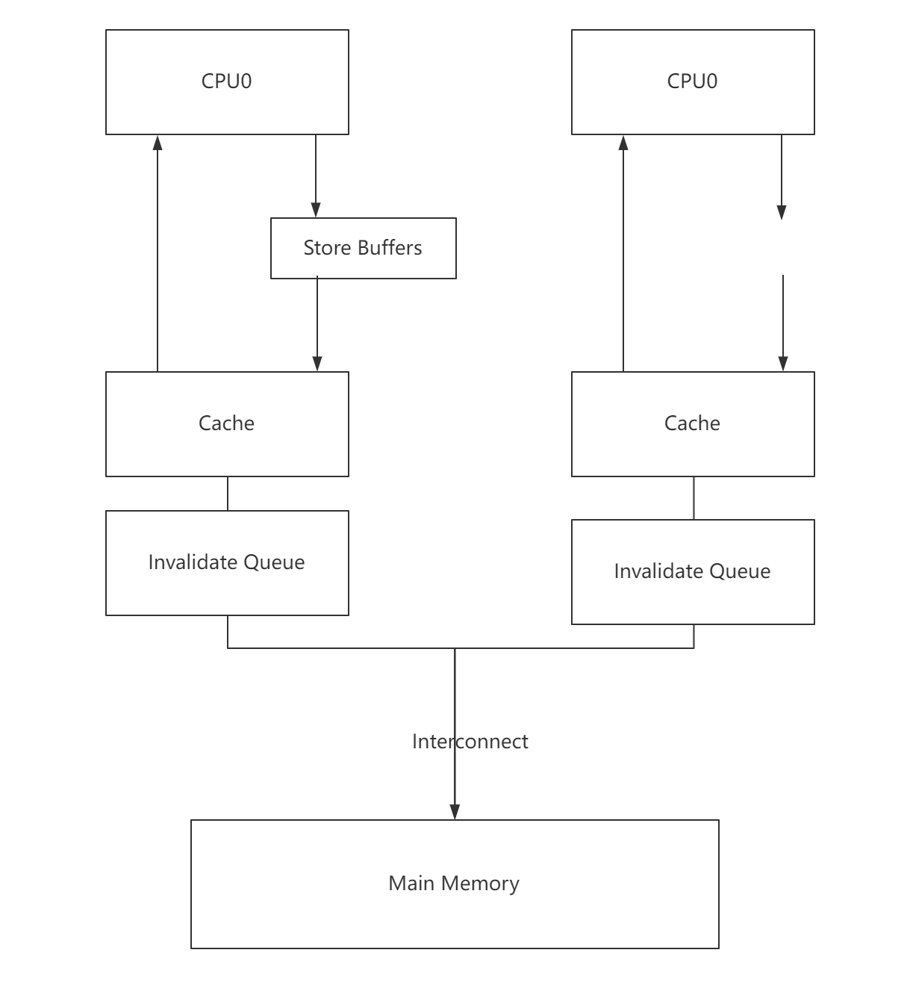

# Volatile

## 一个demo

```java
public class StopDemo {
    public static boolean stop = false;

    public static void main(String[] args) throws InterruptedException {
        Thread t = new Thread(()->{
            int i = 0;
            while (!stop) {
                i++;
            }
            System.out.println("This thread is end");
        });
        t.start();
        Thread.sleep(1000);
        stop = true;
    }
}
```

这个`This thread is end`会输出吗？



这个程序是永远不会结束的，为什么呢？因为此时的程序并不是我们所预想的那样运行的。jvm的编译器有两种一种是客户端编译器`Client Compiler`也称C1编译器，还有一种是服务端编译器`Servcer Compiler`服务端编译器，也称C2编译器，在服务端编译器的情况下，会对jvm做一些优化，比如：

> - 无用代码删除
> - 循环展开
> - 循环表达式外提
> - 消除公共子表达式
> - 。。。

这个时候jvm对此程序做了循环表达式外提的优化。原程序

```java
while(!stop) {
    i++;
}
```

被jvm做了优化成了

```java
if(!stop) {
    while(true) {
		i++;
    }
}
```

这样就可以看出，这个程序是永远都不会运行结束了。那么我们怎么让他结束呢？最暴力的方式就是讲C2编译器给关闭了。关闭的jvm参数为`-Djava.compiler=NONE`



可以看出此时程序运行结束了，但是这样做太暴力了，将jvm的所有优化都给关闭了，那么有什么其他的方式可以结束这段程序吗？

- 添加输出语句

```java
while (!stop) {
    i++;
    System.out.println(i);
}
```

- 创建一个文件

```java
while (!stop) {
    i++;
    new File("a.txt");
}
```

- 在stop属性加上关键字volatile

```java
public static volatile boolean stop = false;
```

这种stop的修改对程序运行不能按预期进行，我们称之为线程的可见性。


## 可见性

什么是可见性？可见性就是线程操作对线程（包含本线程）不可见。

### 导致可见性的情况

哪些情况会导致可见性呢？

- jvm的优化
- CPU高速缓存
- CPU指令及其指令重排序

想要清楚可见性的原因，要从两个方面来描述，硬件层面和软件层面

### 硬件层面

#### CPU利用率的最大化

cpu的执行速度是非常快的，如果每次我们取数据都是从缓存中读取，将非常浪费CPU的资源，因为CPU的运行速度远远高于内存的I/O速度。比如，当我们向内存发送一个读操作时，在等待内存返回之前，整个CPU都是处于一个闲置状态，直到返回之后，CPU继续执行下一个操作指令。那么该怎么优化呢？开发者在硬件设备、操作系统及编译器层面做了很多优化。

- 在CPU层面增加寄存器，来保存一些关键变量和临时数据，还增加了CPU的高速缓存，以减少CPU和内存的I/O等待时间
- 在操作系统层面引入了线程和进程，也是说的，当前进程或线程处于等待状态，CPU会把时间片分给其他线程或进程，从而减少CPU的闲置时间，最大化地提升CPU使用率。
- 在编译器层面优化，减少与内存的交互次数

以上这些是为了提升CPU的使用效率，但是也正是这些优化，导致可见性问题。

#### CPU的高速缓存

CPU和内存的I/O操作时无法避免的，为了降低内存的I/O耗时，开发者在CPU层面设计了高速缓存，用于存储与内存交换的数据。CPU读操作时，会优先从高速缓存中读取目标数据，如果目标数据不存在，就会从内存中加载目标数据到高速缓存中，再返回给处理器。

在x86架构的处理器，CPU的高速缓存通常分为L1、L2、L3三级，它的具体结构如下



说明：

> - L1 和 L2是CPU的核内缓存
>
> - L1D 是一级数据缓存
>
> - L1I是一级指令缓存
>
> - L3 是CPU核心共享缓存
>
> - 缓存的大小离CPU的核心越近就越小，读取速度越快
>
> - CPU读取数据的顺序也是由近到远，当加载一个数据首先是去L1上读取，没有就去L2，再没有就去L3，都没有就会去内存加载
> - 从缓存行加载时数据也流转是内存-L3-L2-L1



#### 缓存行的实现

CPU的高速缓存，是由若干个缓存行组成的，也就是说，缓存行是高速缓存的最小单位，也是CPU和内存交换数据的最小单元。在x86架构中，每一个缓存行的大小为64位，即8个字节。此时每次从内存中加载8个字节的数据保存到缓存行，也就意味着，高速缓存行中存放的是连续位置的数据，这是基于空间局部性原理的实现。

**空间局部性原理**：是指如果一个存储器的位置被引用，那么将来它附近的位置也会被引用，这种缓存行读取的方式能够减少与内存的交互次数，提升CPU的利用率，从而节省CPU读取数据的时间。

#### 缓存行的伪共享

我们刚说了每次加载附近的数据，用以减少内存的交互次数，但是当缓存行的其中一个数据被更改，那么整个缓存就会失效，这样就达不到我们预计的共享结果->减少内存交互。

我们看一个demo

```java
public class FalseSharingDemo {
    public static void main(String[] args) throws InterruptedException {
        testPointer(new Pointer());
    }

    private static void testPointer(Pointer pointer) throws InterruptedException {
        long start = System.currentTimeMillis();
        Thread t1 = new Thread(() -> {
            for (int i = 0; i < 100000000; i++) {
                pointer.x++;
            }
        });

        Thread t2 = new Thread(() -> {
            for (int i = 0; i < 100000000; i++) {
                pointer.y++;
            }
        });

        t1.start();
        t2.start();
        t1.join();
        t2.join();

        System.out.println(System.currentTimeMillis() - start);
        System.out.println(pointer);
    }
}

class Pointer {
    volatile long x;
    volatile long y;
}
```

运行结果



虽然x和y都在同一个缓存行中，但是每次x的改变，或者y的改变都会让缓存行失效，这样就会导致CPU又需要从内中加载数据，重新填充缓存行。

那么如果我们加载x时，把缓存行填满，这样x和y就不在一个缓存行上，那么x的改变，不会影响到y的缓存行，也就是y的缓存不用重新去内存加载，同理x的改变，只有本线程在调用，也不影响到其他线程的使用，也不需要从内存中重新加载，只要修改自己缓存行的数据即可。

1、手动填充缓存行

```java
class Pointer {
    volatile long x;
    long p1, p2, p3, p4, p5, p6, p7;
    volatile long y;
}
```

2、添加注解@Contended，同时配置JVM参数`-XX:-RestrictContended`

#### 缓存一致性

因为在CPU的缓存中L1和L2的缓存是私有的，如果CPU0和CPU1都缓存了相同的数据x=1,此时CPU1对进行了修改，x=1 -> x=2但是因为是CPU1私有的修改，CPU0读取的x的值是不是还是1呢？



为了解决这个问题，开发者在CPU层面上引入了总线锁和缓存锁机制。

什么是总线？

总线是CPU与内存、输入输出设备传递信息的公共通道，当CPU访问内存进行数据交互时，必须进过总线来传输。

什么是总线锁？

总线锁，就是在总线上加一个锁标记，确保共享内存在只有一个CPU可以访问，这样做虽然解决了缓存一致性的问题，但是也导致了CPU的效率直线下降，于是从P6系列开始增加了缓存锁机制。

什么是缓存锁？

缓存锁指的是，如果当前CPU访问的数据已经缓存在其他CPU高速缓存中，那么CPU不会在总线上声明Lock信号，而是采取缓存一致性协议来保证多个CPU的缓存一致性。

那么CPU会使用哪一种方式解决缓存一致性呢？

如果当前CPU支持缓存锁，就使用缓存锁，如果不支持，就使用总线锁。

##### 缓存一致性协议

不同的CPU类型支持不同的缓存一致性协议，也有区别比如：MEI、MESI、MESIF协议，比较常见的是MESI，MESI是四种状态的缩写，分别是

- M（Modify），表示共享数据只在当前CPU缓存中，并且是被修改的状态，缓存的数据和主存中的数据不一致。
- E（Exclusive），表示缓存独占状态，数据只缓存在当前CPU中，并且没有别修改。
- S（Shared），表示数据可能被多个CPU缓存，并且各个缓存中的数据与主存中保存一致
- I（Invalid），表示缓存已失效

这四种状态会基于CPU对缓存行的操作产生转移，所以MESI协议针对不同的状态添加了不同的监听任务。

- 如果一个缓存行处于M状态，则必须监听所有试图读取该缓存行对应得主存地址的操作，如果监听到这类操作的发生，则必须在该操作执行之前把缓存行中的数据写回主内存。
- 如果一个缓存行处于S状态，那么它必须要监听使该缓存行状态设置为Invalid或者对缓存行执行Exclusive操作的请求，如果存在，则必须把当前缓存行状态设置为Invalid。
- 如果一个缓存行处于E状态，那么它必须要监听其他试图读取该缓存行对应的主存地址的操作，一旦有这种操作，那么该缓存行需要设置为Shared

这个监听过程是基于CPU中Snoopy嗅探协议来完成的，该协议要求每个CPU缓存都可以监听到总线上的数据事件，并做出相应的反应。

那么MESI协议是如何协助处理器来完成缓存一致性呢？

比如，

> - CPU0发出一条从内存读取x的指令，主内存通过总线返回数据后缓存到CPU的高速缓存中，并且设置该缓存的状态为E。
> - CPU1同样发出一条针对x的读取指令，那么当CPU0检测到缓存地址冲突时，就针对该消息做出响应，将缓存在CPU0的x的值通过Read Response消息返回给CPU1,此时x分别存在于CPU0和CPU1的高速缓存中，所以x的状态为S
> - 当CPU0把x的值改成x=30时，把自己的缓存行设置为E，接着，把修改后的值写入内存，此时x是共享状态，同时需要发送一个Invalidate消息给其他缓存，CPU1收到消息后，将高速缓存中的x设置为Invalid状态。

#### Volatile解决可见性问题

volatile是如何解决可见性问题的呢？

在修改stop变量时，会增加一个Lock信号，这使得基于缓存锁或者总线锁达到缓存一致性，从而保证结果的可见。

除了高速缓存导致可见性，指令重排序也会导致可见性。

#### 指令重排序

什么是指令重排序？先看一个demo

```java
public class MemoryReOrderingDemo {
    public static int x = 0, y = 0;
    public static int a = 0, b = 0;

    public static void main(String[] args) throws InterruptedException {
        int i = 0;
        while (true) {
            i++;
            x = 0;
            y = 0;
            a = 0;
            b = 0;
            Thread t1 = new Thread(() -> {
                a = 1;
                x = b;
            });
            Thread t2 = new Thread(() -> {
                b = 1;
                y = a;
            });

            t1.start();
            t2.start();
            t1.join();
            t2.join();

            if (x==0 && y== 0) {
                String result = "第" + i + "次（" +x + "," + y +")";
                System.out.println(result);
                break;
            }
        }
    }
}
```

上面这个程序正常情况下，x和y不可能同时为0，但是我们看一下运行结果：


但是结果却出现x和y都同时为0的情况。这就是出现了指令重排序的情况：

```java
Thread t1 = new Thread(() -> {
    x = b; // 指令重排序
    a = 1;
});
Thread t2 = new Thread(() -> {
    y = a; // 指令重排序
    b = 1;
});
```

经过重排序后，如果t1和t2同时运行就会出现x,y同时为0的情况。

那么什么是指令重排序呢？

CPU为了优化性能而对指令进行重新排序。

从源代码最终运行指令，重排序会经历两个阶段

**第一阶段：编译器重排序**

**第二阶段：处理器重排序，处理器重排序分为两个部分**

> 并行指令集重排序
>
> 内存系统重排序，这是处理器引入StoreBuffer缓存区延时写入产生的指令执行顺序不一致的问题


### CPU层面的指令重排序的本质

当我们需要将S状态的缓存行进行修改，那么我们需要如下图



当CPU0发送Invalidate指令时，需要等待CPU1返回Acknowledgement，在等待这段时间，CPU0一直时空闲状态，为了减少这种缓存一致性协议带来CPU资源的浪费，开发者在CPU层面设计了一个Store Buffers。

#### Store Buffers

Store Buffers是为了防止缓存一致性协议带来一些CPU的阻塞，所以在CPU与缓存行之间增加了一个Store Buffers，如下图



增加Store Buffers之后，CPU0会先发送一个Invalidate消息给其他包含该缓存行的CPU1，,并把修改后的值写入到StoreBuffers中，然后继续执行后续的操作指令，等收到CPU1的ack消息后，CPU0再把StoreBuffers移到缓存行中。

但是这种优化方式还是会带来可见性问题

```java
a = 1;
b = a+1;
assert(b==2)
```

看上面这段程序，理论上b==2肯定为TRUE，但是有可能为false。比如出现下面情况

> 1、CPU执行a = 1指令，由于a不存在CPU0的缓存行中，但是在其他CPU是一个S状态，所以CPU0会发送一个read invalidate给CPU1，试图从其他缓存了改变量的CPU中读取a的值，并且使其他CPU缓存行失效
>
> 2、CPU0 将a = 1写到Store Buffers中
>
> 3、CPU1收到read invalidate消息后，返回Read Response。
>
> 4、由于Store Buffers的存在，CPU0继续执行b = a+1的指令，此时缓存行还没有加载b，于是发出read invalidate的消息，从内存中加载b = 0;
>
> 5、CPU0收到Read Response，更新CPU0的缓存行a=0
>
> 6、CPU0从缓存行加载a=0的值，完成b=a+1的计算，此时b的结果为0
>
> 7、CPU0将Store Buffers中a=1加载到缓存行中
>
> 8、CPU0最后执行assert(b==2)，断言失败

造成可见性的原因，是a这个值既在缓存行中又在StoreBuffers中，这两个位置的值不同，导致最后断言失败。所以硬件工程师继续优化，引入了Store ForWarding机制

#### Store Forwarding

Store Forwarding是指每个CPU在加载数据前，会先引用当前的Store Buffers中的数据。这个方法看似完美的解决了CPU利用率及可见性问题，但实际上并未如此，我们继续看下面的例子

```java
int a = 0,b = 0;
executeToCPU0(){
    a = 1;
    b = 1;
}
executeToCPU1(){
    while(b == 1) {
        assert(a == 1)
    }
}
```

这个程序看似assert(a == 1)不可能断言失败，但是还是可能会发生

> 1、CPU0执行a = 1指令，a是E状态，并且a不存在CPU0缓存行中，因此CPU0把a=1写入到Store Buffers中，并发送MESI协议消息read invalidate给CPU1.
>
> 2、CPU1执行while（b==1)，同样CPU1中没有缓存b的变量，因此CPU1发送一个read invalidate给CPU0
>
> 3、CPU0执行b=1的指令，而b变量存在于CPU0的缓存中，也就是缓存行处于M或者E的状态，因此直接把b=1写入到缓存中
>
> 4、CPU0收到CPU1发来的read invalidate消息，将缓存行中b=1返回给CPU1，并修改改缓存行状态为S
>
> 5、CPU1收到包含b的缓存行，将其保存到CPU高速缓存中
>
> 6、获取b=1的值，CPU1就行执行assert(a==1)指令，此时CPU1的缓存行中a = 0的，断言失败
>
> 7、CPU1收到CPU0的read invalidate消息，a=0的缓存行放回给CPU0，并且将当前的缓存行设置为I状态，但是这个过程比前面的异步步骤更晚，已经导致了可见性问题
>
> 8、最后CPU0收到a的缓存行，把StoreBuffers中a=1结果同步到缓存行

可见Store Forwarding并不能解决可见性问题。

#### Invalidate Queues

Store Buffers存在确实进一步提升了CPU的利用率，但是Store Buffers本身存储有限，当写入操作都在缓存未命中时，就会导致Store Buffers很容易被填满，被填满之后，必须要等到CPU收到ack消息，Store Buffers指令才能被清理，而这个过程CPU必须要等待，无论该CPU中后续指令是否存在缓存行中，

所以我们按照Store Buffers理念，增加了Invalidate Queues设计



添加Invalidate Queues还是会导致可见性问题，这里就不细细讲解了。


### 软件层面

CPU本身是一个工具，它并不知道什么时候该优化，什么时候不优化，因此CPU设计者们提供了一个内存屏障指令，开发者可以在合适的位置插入内存屏障指令，相当于告诉CPU指令之间的关系，避免CPU内存系统重排序问题的发生。

#### 内存屏障指令

- 读屏障指令（Ifence）,将Invalidate Queues中的指令立即处理，并且强制读取CPU的缓存行。执行Ifence指令之后的操作，不会被重排序到Ifence之前的操作，这意味着其他CPU暴露出来的缓存行状态对当前CPU可见
- 写屏障指令（sfence），它会把Store Buffers中修改刷新到缓存行这种，使得其他CPU能看见这些操作
- 读写屏障指令(mfence)，相当于Ifence和sfence的混合体

注意：Lock指令自带mfence效果，也就是说，任何带有Lock前缀的指令都会有内存屏障的作用，在常见的X86CPU架构下，通常使用Lock指令前缀加一个空操作来实现内存屏障。

#### jvm提供的内存屏障指令

- LoadLoad Barriers
- StoreStore Barriers
- LoadStore Barriers
- StoreLoad Barriers


## Volatile实现原理

首先我们来看加volatile的字节指令

```tex
  public static volatile boolean stop;
    descriptor: Z
    flags: ACC_PUBLIC, ACC_STATIC, ACC_VOLATILE

```

可以看到修饰volatile关键字的属性多了个ACC_VOLATITLE的flag，最终jvm层面会根据这个标志，调用`OrderAcess::storeload()`	内存屏障方法，会基于Lock指令来实现内存屏障

回到之前的代码：

```java
public class StopDemo {
    public static volatile boolean stop = false;

    public static void main(String[] args) throws InterruptedException {
        Thread t = new Thread(()->{
            int i = 0;
            while (!stop) {
                i++;
            }
            System.out.println("This thread is end");
        });
        t.start();
        Thread.sleep(1000);
        stop = true;
    }
}
```

上述代码中，stop增加了volatile关键字后，保证了可见性的原因是：

> 1、volatile关键字会在jvm层面做声明一个c++的volatile，它能够防止JIT层面的指令重排序
>
> 2、在对修饰了volatile关键字的stop字段赋值后，JVM会调用storeload（）内存屏障方法，该方法声明了lock指令，该指令有两个作用
>
> - 在CPU层面，给stop赋值的指令先存储到Store Buffers中，所以lock指令使得Store Buffers中的数据刷新到缓存
> - 使得其他缓存了stop的CPU缓存行失效

也就是当其他线程再去读取stop值时，会从内存中或者其他缓存了Stop字段无的缓存行中重新加载，使得线程能获取stop的最新值。


## Happens-Before模型

什么是happens-before模型？

happens-before用来描述两个操作指令的顺序关系，如果一个操作和另外一个操作存在happens-before关系，那么就意味着第一个操作对第二个操作可见。

### Happens-Before规则

- 程序顺序规则

在同一个线程中，存在两个操作x和y，并且在源程序中x排在y的前面，这就意味着x happens-before y，这就是as-if-serial语义。看下面这段代码

```java
int a = 2;
int b = 2;
int c = a*b;
```

这段程序就意味着a happens-before b，可能会有疑惑，a和b之间没有依赖关系，明明可以重排序的呀，也就是说可能存在b先执行情况。

注意：两个操作之间的happens-before的关系，并不是必须要按照顺序执行的，如果重排序之后，保证在单线程的结果不产生差异，则允许重排序。在上述的案例中，a和b重排序之后，并不影响执行结果，所以执行顺序不会受到影响。另外，happens-before描述的是可见性规则，不是程序执行顺序规则。

- 传递性规则

如果存在关系

> - A Happens-Before B
> - B Happens-Before C

那么 A Happens-Before C

- volatile变量规则
- 监视器锁规则
- start规则
- join规则

