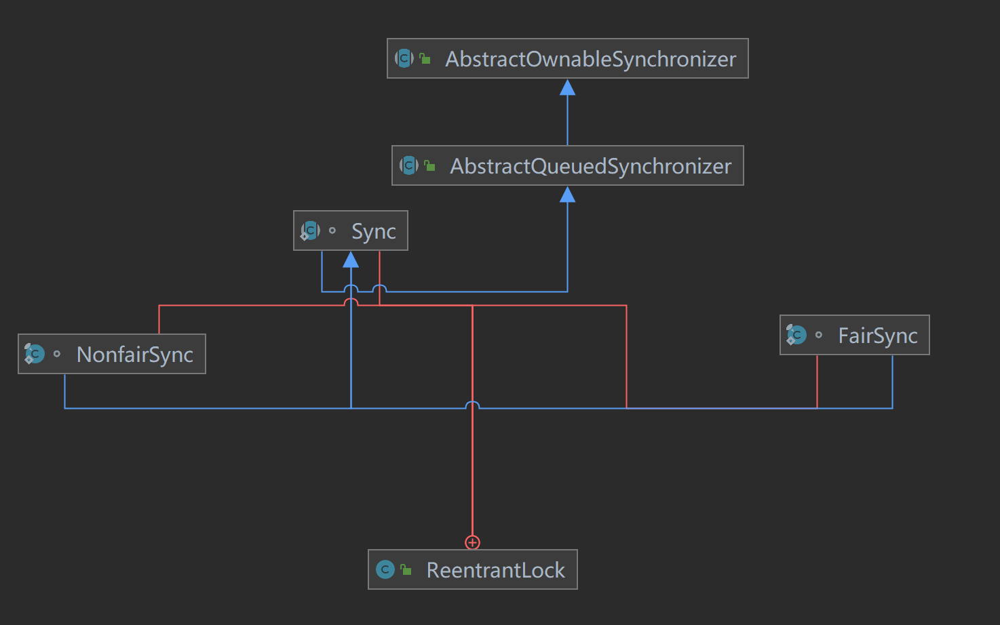
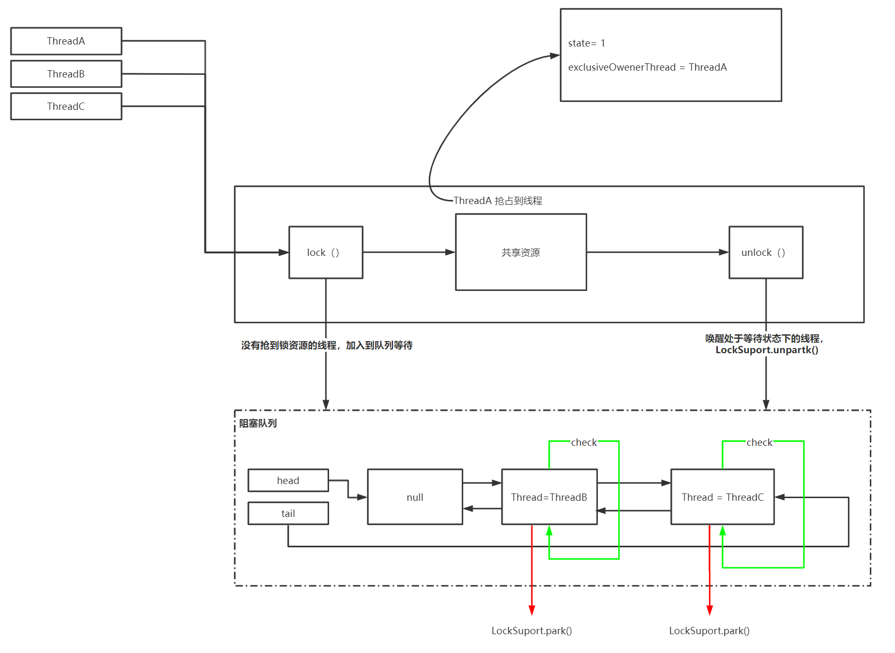

# 重入锁和读写锁

在J·U·C包中提供大量的并发编程相关的辅助工具，比如阻塞队列，线程池，锁，并发集合等。JUC中有一个Lock接口，它的作用和synchronized的相似，都是为了保证线程安全提供的解决方案。Lock定义了抢占锁和释放锁相关操作。

- lock()
- tryLock()
- unlock()
- ...

Lock是一个接口，它只是提供了抢占锁和释放锁的抽象方法，在JUC中提供了以下具体实现类

- ReentrantLock，重入锁，属于排它锁类型，功能和synchronized相似
- ReentrantReadWriteLock，可重入读写锁，该类维护了两个锁，一个是ReadLock，一个是WriteLock，它们分别实现了Lock接口
- StampedLock，java8引进的新的锁机制，它是ReentrantReadWriteLock的改进版本。


## ReentrantLock

ReentrantLock是一个可以支持重入的排他锁。重入指的是一个线程获得了，后续该线程再去抢占相同的锁资源不需要再竞争锁。排他锁，就是同一时刻只允许一个线程获得锁资源。

### ReentrantLock的使用

```java
public class ReentrantLockDemo {
    static Lock lock = new ReentrantLock();

    private int count = 0;

    public void incr() {
        lock.lock(); // 加锁
        try {
            count++;
        }finally {
            lock.unlock();
        }
    }

    public static void main(String[] args) throws InterruptedException {
        ReentrantLockDemo reentrantLock = new ReentrantLockDemo();
        Thread[] threads = new Thread[2];
        for (int i = 0;i<2;i++) {
            threads[i] = new Thread(() ->{
                for (int k = 0; k<100000;k++) {
                    reentrantLock.incr();
                }
            });
            threads[i].start();
        }
        threads[0].join();
        threads[1].join();
        System.out.println(reentrantLock.count); // 输出200000
    }
}
```

上述demo使用了ReentrantLock的lock()和unlock()方法，并针对count++的非原子操作进行加锁，保证了在多线程的情况下，线程的 安全性。


### ReentrantLock的猜想

我们在明确一下，ReentrantLock是一个可重入的排他锁，如果要让我们去设计，需要考虑哪些问题呢？

> - 锁的互斥，必须有一个共享变量去记录锁有没有被抢占
> - 可重入，需要一个记录当前是哪个线程占有锁的变量
> - 没有抢到锁的线程，需要阻塞，获得锁的线程在释放线程的时候要唤醒阻塞的线程
> - 要有一个地方去存储这些阻塞的线程

针对这些猜想，我们看一下ReentrantLock是如何实现的


### ReentrantLock的实现原理

ReentrantLock中依赖了AbstractQueuedSynchronizer类来实现线程同步，ReentrantLock的类关系图及依赖情况如下



ReentrantLock定义了一个同步类Sync，这个类有两个实现，一个是FairSync(公平锁)，一个是NonFairSync(非公平锁)，两者分别代表ReentrantLock中竞争的公平和非公平特性。

Sync继承了AbstractQueuedSynchronizer抽象类，也就是说对于排他锁的抽象逻辑都是在AbstractQueuedSynchronizer中完成的。

#### AbstractQueuedSynchronizer

AbstractQueuedSynchronizer简称AQS，后文都用AQS替代。AQS是实现同步锁的核心类，AQS中提供了两种锁的实现

- 独占锁。同一时刻只允许一个线程获取锁。
- 共享锁。同一时刻可允许多个线程获取锁。

AQS维护了一个`volatile int state`,用来表示共享资源被抢占的情况。

> state = 0 表示共享资源空闲
>
> state > 1 表示共享资源被抢占

state的修改是同CAS来完成的，能够保证多个线程竞争原子性。

AQS是一个抽象类，所以在使用的时候，我们需要集成该类，然后实现共享变量state的获取和释放，而AQS帮助我们实现了线程的等待和唤醒。具体需要重写的方法如下：

> tryAcquire(int)，独占方式获取资源，成功返回true，失败返回false
>
> tryRelease(int), 独占方式释放资源，成功返回true，失败返回false
>
> tryAcquireShared(int)，共享方式获取资源，负数表示失败，0表示成功，但没有剩余资源，正数表示成功，有剩余资源。
>
> tryReleaseShared(int)，共享方式释放资源，如果释放后允许唤醒后续等待结点则返回true，否则返回false。

以ReentrantLock获得重入锁为例，同时有多个线程竞争锁资源时，当其中一个线程竞争到锁资源时，这个线程会将stata+1，并同时将共享变量exclusiveOwnerThread的值设为当前线程，当然这些操作都是通过CAS完成的。这时其他线程再尝试去修改state值失败，或者发现state大于0，其他线程就是加入到阻塞队列中，等待被唤醒。



### ReentrantLock获取锁源码解析

ReentrantLock#lock()代码如下

```java
public void lock() {
    sync.lock();
}
```

sync是一个抽象的静态内部类，它通过继承AQS来实现重入锁的逻辑，我们在前面说过，AQS提供了线程阻塞及唤醒功能，但他并不具备业务功能，所以在不同的场景中Sync会继承AQS来实现不同的应用场景。

sync有两个具体的实现

- NonfairSync
- FairSync

这里就以FairSync为例讲解

#### FairSync

##### acquire(1)方法

```java
final void lock() {
    acquire(1);
}
```

```java
public final void acquire(int arg) {
    if (!tryAcquire(arg) &&
        acquireQueued(addWaiter(Node.EXCLUSIVE), arg))
        selfInterrupt();
}
```

这个方法主要逻辑如下

- 通过tryAcquire尝试获取独占锁，如果成功返回true，失败返回false
- 如果tryAcquire返回false，说明锁被占用，只能通过addWaite将当前线程封装称NODE并加入AQS队列中
- acquireQueued()，方法将Node作为参数，通过自选尝试获取锁资源。

##### tryAcquire

```java
protected final boolean tryAcquire(int acquires) {
    Thread current = Thread.currentThread();
    int c = getState();
    int w = exclusiveCount(c);
    if (c != 0) {
        // (Note: if c != 0 and w == 0 then shared count != 0)
        if (w == 0 || current != getExclusiveOwnerThread())
            return false;
        if (w + exclusiveCount(acquires) > MAX_COUNT)
            throw new Error("Maximum lock count exceeded");
        // Reentrant acquire
        setState(c + acquires);
        return true;
    }
    if (writerShouldBlock() ||
        !compareAndSetState(c, c + acquires))
        return false;
    setExclusiveOwnerThread(current);
    return true;
}
```

tryAcquire具体实现逻辑如下：

- 判断当前锁的状态，如果c！=0 表示当前锁资源已被占
  - 此时就需要判断是否是自己占用了
  - 还要判断是否超过了最大重入次数
- 如果c == 0说明此时锁资源没有被占用，此时要去判断是否有等待队列
  - 如果有，因为公平锁的缘故，不能直接获取锁资源，返回false
  - 如果没有，CAS设置state值，设置失败false，设置成功，继续下一步，
  - 将独占线程名称改为当前线程

##### addWaiter

```java
private Node addWaiter(Node mode) {
    Node node = new Node(Thread.currentThread(), mode);
    // Try the fast path of enq; backup to full enq on failure
    Node pred = tail;
    if (pred != null) {
        node.prev = pred;
        if (compareAndSetTail(pred, node)) {
            pred.next = node;
            return node;
        }
    }
    enq(node);
    return node;
}
```

addWaiter具体的实现逻辑如下：

- 将当前线程封装称Node，并进行存储，后续可以直接从节点中获取线程，再通过unpark的方法来唤醒
- 通过pred != null来判断当前链表是否完成初始化，如果已经初始化，则通过CAS将当前线程节点设置为尾节点，并建立双向关联
- 如果链表没有初始化，或者CAS失败，则通过enq（）来完成添加操作

##### enq

```java
private Node enq(final Node node) {
    for (;;) {
        Node t = tail;
        if (t == null) { // Must initialize
            if (compareAndSetHead(new Node()))
                tail = head;
        } else {
            node.prev = t;
            if (compareAndSetTail(t, node)) {
                t.next = node;
                return t;
            }
        }
    }
}
```

该方法通过自旋来完成同步队列的初始化，并把当前节点添加到同步队列中。

##### acquireQueued

```java
final boolean acquireQueued(final Node node, int arg) {
    boolean failed = true;
    try {
        boolean interrupted = false;
        for (;;) {
            final Node p = node.predecessor();
            if (p == head && tryAcquire(arg)) {
                setHead(node);
                p.next = null; // help GC
                failed = false;
                return interrupted;
            }
            if (shouldParkAfterFailedAcquire(p, node) &&
                parkAndCheckInterrupt())
                interrupted = true;
        }
    } finally {
        if (failed)
            cancelAcquire(node);
    }
}
```

addWaiter()，把线程添加到链表后，把当前线程的Node节点作为参数，传给acquireQueued()方法。

acquireQueued的主要逻辑如下：

- 利用自旋尝试通过tryAcquire()来抢占锁，抢占的条件是前一个节点是head节点
- 如果抢占不到锁，不能让线程一直重试，通过shouldParkAfterFailedAcquire将线程阻塞

##### shouldParkAfterFailedAcquire

```java
private static boolean shouldParkAfterFailedAcquire(Node pred, Node node) {
    // 设置节点的状态，注意，这个ws是前节点的状态值
    int ws = pred.waitStatus;
    // 如果前置节点是SIGNAL，那么只需要等待前置节点被释放
    if (ws == Node.SIGNAL)
        return true;
    // 如果大于0，说明prev取消了排队，直接移除这个节点
    if (ws > 0) {
        do {
            node.prev = pred = pred.prev;
        } while (pred.waitStatus > 0);
        pred.next = node;
    } else {
		// 利用CAS设置前节点的状态
        // 为什么前节点不自己设置自己的状态，而要通过后一个节点来设置？
        // 因为前一个节点的线程都挂起了，无法设置
        compareAndSetWaitStatus(pred, ws, Node.SIGNAL);
    }
    return false;
}
```

Node有五种状态

- CANCELLED ->1，如果在同步队列中等待的线程等待超时或者被中断，那么需要从同步队列中取消该节点，节点waitStatus为CANCELLED，即为结束状态，进入该状态后的节点将不再变化
- SIGNAL -> -1，只要前置节点释放锁，就会通知后续节点的线程
- CONDITION ->-2
- PROPAGATE ->-3,在共享模式下，PROPAGATE状态的线程处于可运行状态
- 0 初始状态

shouldParkAfterFailedAcquire返回是true，则要调用parkAndCheckInterrupt方法挂起当前线程

##### parkAndCheckInterrupt

```java
private final boolean parkAndCheckInterrupt() {
    LockSupport.park(this);
    return Thread.interrupted();
}
```

### ReentrantLock释放锁源码解析

```java
public void unlock() {
    sync.release(1);
}
public final boolean release(int arg) {
    if (tryRelease(arg)) {
        Node h = head; // 得到AQS的head节点
        // head 节点不为null，且状态不等于0，则调用unparkSuccessor(h)方法唤醒后续节点
        if (h != null && h.waitStatus != 0)
            unparkSuccessor(h);
        return true;
    }
    return false;
}
```

#### tryRelease

```java
protected final boolean tryRelease(int releases) {
    int c = getState() - releases;
    if (Thread.currentThread() != getExclusiveOwnerThread())
        throw new IllegalMonitorStateException();
    boolean free = false;
    if (c == 0) {
        free = true;
        setExclusiveOwnerThread(null);
    }
    setState(c);
    return free;
}
```

这个方法通过修改state的值来释放锁，独占锁在加锁时，状态会加1，在释放锁，状态就会减1，同一个锁在重入后，可能会叠加为2,3,4这些值，只有调用unlock()方法的次数与调用lock方法的次数相等，才会将ExclusiveOwenerThread线程设置为空，表示完全释放锁

锁释放成功，会通过unparkSuccessor来唤醒同步队列中的线程。

#### unparkSuccessor

```java
private void unparkSuccessor(Node node) {
    // 获取head节点的状态
    int ws = node.waitStatus;
    if (ws < 0)
        // 设置head节点状态为0
        compareAndSetWaitStatus(node, ws, 0);
    // 获取head节点下一个节点状态
    Node s = node.next;
    // 清除cancelled状态节点，从尾部对头清理
    // 为什么从尾部开始清理
    // 因为添加的时候，是从尾部开始添加的，这样就避免了遍历列表不透彻
    if (s == null || s.waitStatus > 0) {
        s = null;
        for (Node t = tail; t != null && t != node; t = t.prev)
            if (t.waitStatus <= 0)
                s = t;
    }
    if (s != null)
        // 如果next节点不为空，则直接唤醒这个线程即可
        LockSupport.unpark(s.thread);
}
```

#### 释放锁的线程继续执行

```java
final boolean acquireQueued(final Node node, int arg) {
    boolean failed = true;
    try {
        boolean interrupted = false;
        for (;;) {
            final Node p = node.predecessor();
            if (p == head && tryAcquire(arg)) {
                setHead(node);
                p.next = null; // help GC
                failed = false;
                return interrupted;
            }
            if (shouldParkAfterFailedAcquire(p, node) &&
                parkAndCheckInterrupt())
                interrupted = true;
        }
    } finally {
        if (failed)
            cancelAcquire(node);
    }
}
```

当线程被唤醒后，继续从阻塞的位置开始执行：

ThreadA已经释放锁了，ThreadB就可以通过tryAcquire来抢占锁，抢占成功，将ThreadB设置为head节点，并且断开和前一个节点的指向关系，并把原head节点next指向null


## ReentrantReadWriteLock

更新中。。。


## StampedLock

更新中。。。